# **PROYECTO API + INTERFAZ**

## **Documentos**

###  Usuario

Documento donde vamos a almacenar la información sobre los usuarios de la base de datos.

| _**Campo**_   | **_Tipo_** | _**Descripción**_                                                                                       |
|---------------|------------|---------------------------------------------------------------------------------------------------------|
| **_id**       | String?    | Campo que va a actuar como la clave primaria de la tabla. Se iguala al correo del usuario al crear uno. |
| **username**  | String     | Nick del usuario.                                                                                       |
| **password**  | String     | Contraseña del usuario.                                                                                 |
| **email**     | String     | Email del usuario.                                                                                      |
| **direccion** | Direccion  | Dirección del usuario.                                                                                  |
| **rol**       | String?    | Rol del usuario.                                                                                        |

+ El campo `username` no puede estar vacío o ser nulo.
+ El campo `password` no puede estar vacío o ser nulo.
+ El campo `email`no puede estar vacío o ser nulo. Debe contener '@' y alguna terminación válida.
+ Dentro del campo `direccion` se comprobarán si la provincia y el municipio son correctos y si el municipio pertenece a la provincia ingresada.
+ El campo `rol` será asignado automaticamente a 'USER' si no se ingresa el valor 'ADMIN' o si el campo se deja vacío.

### Tarea

Documento donde vamos a almacenar la información sobre las tareas que se les asignan a los usuarios.

| _**Campo**_         | **_Tipo_** | **_Descripción_**                                                              |
|---------------------|------------|--------------------------------------------------------------------------------|
| **_id**             | String?    | Campo que va a actuar como la clave primaria de la tabla.                      |
| **titulo**          | String     | Campo que resume la tarea.                                                     |
| **estado**          | Boolean    | Campo que indica el estado de la tarea. True = Terminado, False =  En proceso. |
| **descripcion**     | String     | Campo que indica en que consiste la tarea.                                     |
| **usuario**         | Usuario    | Campo que indica el usuario en posesión de esa tarea.                          |

+ El campo `titulo` no puede estar vacío o ser nulo.
+ El campo `descripcion` no puede estar vacío o ser nulo.
+ El campo `usuario`no puede estar vacío o ser nulo. Debe ser un usuario registrado en la aplicación.

## **Endpoints**

### Usuarios

+ _**GET**_ > **usuarios/login** > Endpoint que va a permitir a un usuario realizar un login en la aplicación. 
    
    Devolverá un token si las credenciales son correctas o una _BAD_REQUEST_ en caso contrario.
+ _**POST**_ > **usuarios/register** > Endpoint que va a permitir realizar un registro de un usuario pasado por el cuerpo de la petición en la aplicación. 

    Devolverá un _CREATED_ si la creación es realizada sin problemas o un _BAD_REQUEST_ si no.
+ _**UPDATE**_ > **usuarios/update** > Endpoint que va a permitir actualizar los campos de un usuario cuyo _id coincida con el valor pasado por el cuerpo de la petición. 

    Devuelve un _OK_ si la actualización es correcta o un _BAD_REQUEST_ si algún campo no es válido.
+ _**DELETE**_ > **usuarios/delete/{_id}** > Endpoint que permite eliminar a un usuario de la aplicación.
  
    Devolverá _OK_ en caso correcto o _BAD_REQUEST_ en caso de que no exista ningún usuario con ese _id.

### Tareas

+ _**POST**_ > **tareas/crear** > Endpoint que permite a un usuario con rol USER añadirse una tarea a sí mismo o a un usuario ADMIN añadirle una tarea a cualquier usuario.

    Devolverá un _CREATED_ en caso de que se cumplan todos los requisitos de lógica de negocio o un _BAD_REQUEST_ si no los cumple.
+ _**GET**_ > **tareas/obtener/{_idUsuario}** > Endpoint que retorna todas las tareas creadas. Si el usuario es USER, solo verá las suyas y si el usuario es ADMIN, las verá todas.

    Devolverá un _OK_ si la petición es realizada sin problemas o un _NOT_FOUND_ si no existen tareas.
+ _**UPDATE**_ > **tareas/marcarTerminada/{_idTarea}** > Endpoint que va a permitir a un usuario USER marcar una tarea cuyo _id coincida con la proporcionada por parámetro como completada. O a un usuario ADMIN marcar cualquier tarea de cualquier usuario que coincida con el _id como completada. 

    Devuelve un _OK_ si la actualización es correcta o un _BAD_REQUEST_ si el usuario no posee esa tarea o no existe ninguna con ese _id.
+ _**DELETE**_ > **tareas/delete/{_idTarea}** > Endpoint que permite eliminar una tarea de un usuario. Si el usuario es USER, solo puede eliminar una tarea propia y si el usuario es ADMIN, puede borrar cualquier tarea de cualquier usuario.

    Devolverá _OK_ en caso correcto, _NOT_FOUND_ en caso de que no exista ninguna tarea con ese _id o _BAD_REQUEST_ si el usuario (en caso de que no sea ADMIN) intenta borrar una tarea que no le pertenece.

# PRUEBAS GESTIÓN USUARIOS

## ANTES DE EMPEZAR

Antes de empezar, en la base de datos contamos con los siguientes datos:

O lo que es lo mismo, un único usuario sobre el que probar el login.

***
# LOGIN CORRECTO

### DESCRIPCIÓN
  
En esta prueba vamos a simular lo que sería un intento de login válido, es decir, usuario y contraseña correctos. Para que el botón de iniciar sesión funcione, el campo usuario debe tener más de 3 caracteres y el campo contraseña más de 6.

## CAPTURAS

### **Username**: prueba

### **Password**: passwordPrueba

***

# LOGINS INCORRECTOS

### DESCRIPCIÓN

En esta prueba vamos a simular lo que sería un intento de login no válido, es decir, usuario o contraseña incorrectos. 

Esto puede deberse a: 

+ Credenciales incorrectas.
+ No se han cumplido los requisitos de longitud en los campos.
+ Uno de los campos no se ha rellenado.

## CAPTURAS

### Credenciales incorrectas

### **Username**: Pepe > No existe en la base de datos.

### **Password**: pepepep > No existe en la base de datos.

***

### Longitud de campos no cumplida

### **Username**: Pepe > No existe en la base de datos.

### **Password**: pepe > No cumple con la longitud mínima.

***

### Campos sin rellenar

### **Username**: Pepe > No existe en la base de datos.

### **Password**: 

***

# REGISTER VÁLIDO

## DESCRIPCIÓN

En esta prueba vamos a simular un intento de registro válido. Esto se llevará a cabo rellenando todos los campos que requiera la aplicación y que los valores introducidos cumplan con los requisitos. Para saber que ha sido correcto, la aplicación nos llevará de vuelta a la pantalla de registro y nos mostrará un mensaje indicativo.

## CAPTURAS

***
# REGISTERS FALLIDOS

## DESCRIPCIÓN

En esta prueba vamos a simular lo que sería un intento de registro no válido, es decir, cualquier campo no ha sido rellenado o no ha pasado la lógica de negocio.

Esto puede deberse a:

+ Credenciales repetidas (Nombre de usuario).
+ Uno de los campos no se ha rellenado.
+ Se ha insertado un valor que no corresponde.
+ Se ha insertado una provincia que no existe.
+ Se ha insertado un municipio que no pertenece a una provincia.
+ Las contraseñas no coinciden.

## CAPTURAS

### Nombre de usuario duplicado

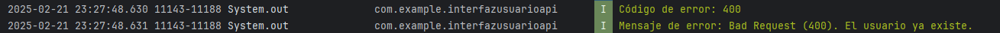

***

### Campos sin rellenar

***

### Valor equivocado 1

***

### Valor equivocado 2

***

### Provincia no existe

***

### Municipio no pertenece a la provincia

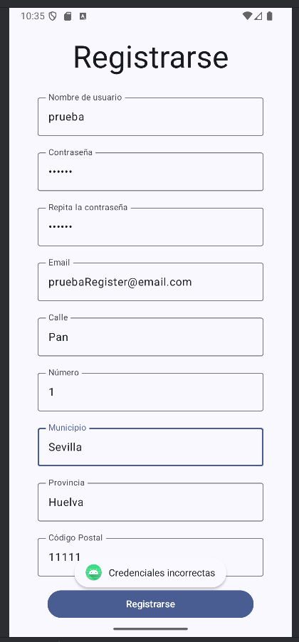

***

### Contraseñas no coinciden

***

# PRUEBAS GESTIÓN TAREAS

## ANTES DE EMPEZAR

Antes de empezar, en la base de datos tenemos los siguientes datos:

## CREAR TAREA EXITOSA

### DESCRIPCIÓN
Vamos a crear una tarea para nuestro usuario (el mismo que en las pruebas superiores.)

### CAPTURAS

***

## CREACIÓN FALLIDA

### DESCRIPCIÓN

La creación de una tarea puede fallar por varios motivos:
+ El título no puede estar vacío.
+ La descripción no puede estar vacía.
+ El usuario designado no existe.
+ Un usuario USER no le puede crear una tarea a otro usuario.
+ Ya existe una tarea con ese id.

### CAPTURAS

## TÍTULO VACÍO

***

## DESCRIPCIÓN VACÍA

***

## USUARIO NO EXISTE

***

## UN USUARIO USER NO PUEDE CREARLE LA TAREA A OTRO USUARIO

**CABE DESTACAR QUE HASTA AHORA HEMOS ESTADO UTILIZANDO UN USUARIO ADMIN PARA LAS PRUEBAS, POR LO QUE VAMOS A USAR UN USUARIO USER PARA ESTA PRUEBA**

***

## TAREA CON ID REPETIDO

***

## OBTENCIÓN DE TAREAS EXITOSAS

## ANTES DE EMPEZAR

Antes de empezar, este es el contenido de la base de datos:

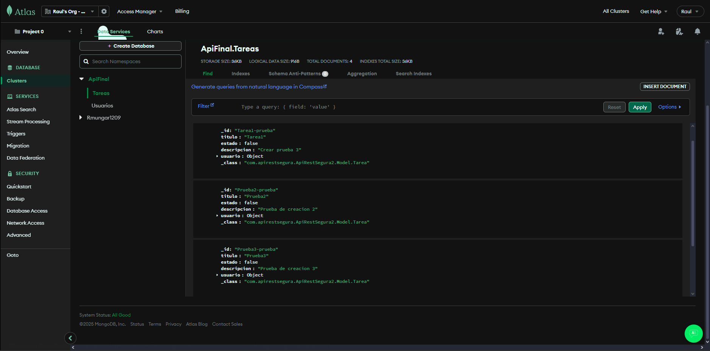
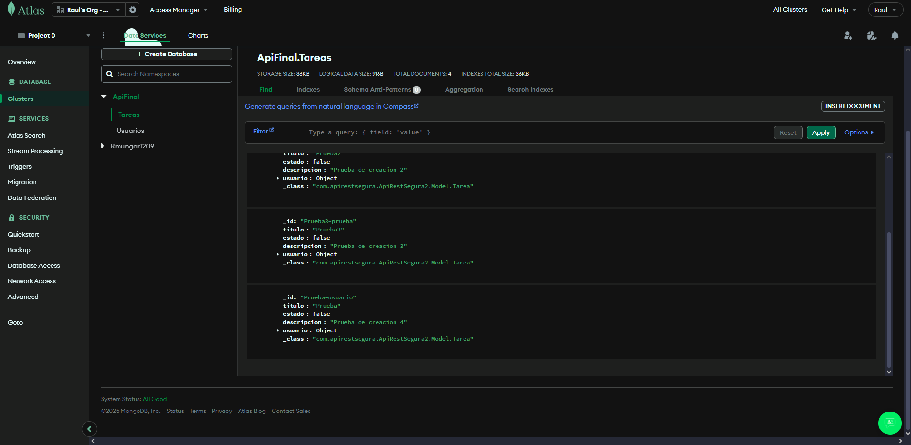

## DESCRIPCIÓN

A continuación, vamos a obtener todas las tareas posibles para un usuario ADMIN y un usuario USER

## CAPTURAS

### USUARIO ADMIN

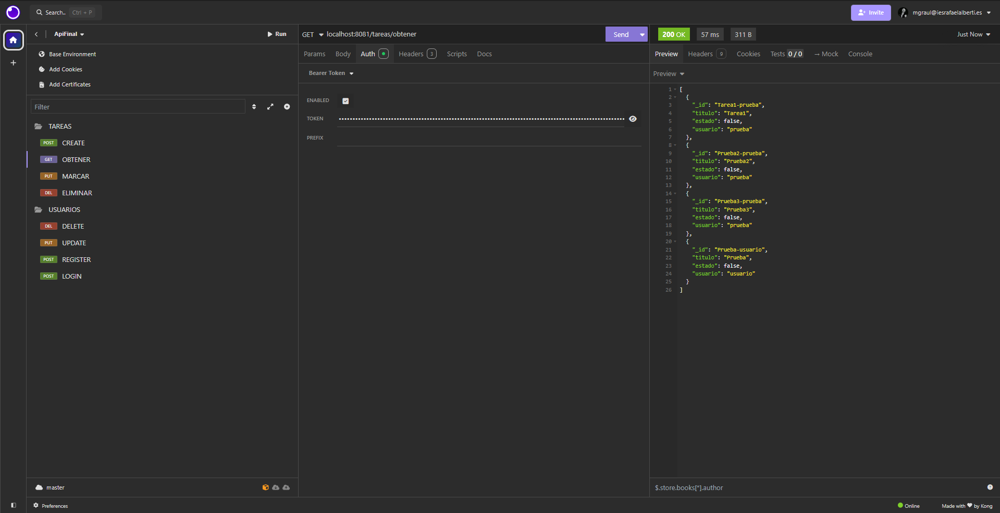

***

### USUARIO USER

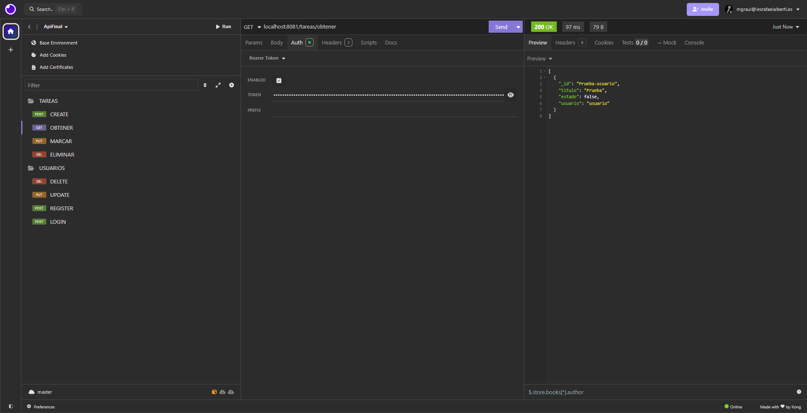

***

## OBTENCIÓN DE TAREAS FALLIDA

## DESCRIPCIÓN

En este caso, este endpoint no puede fallar, salvo que no se halla realizado el login perviamente.

## CAPTURAS

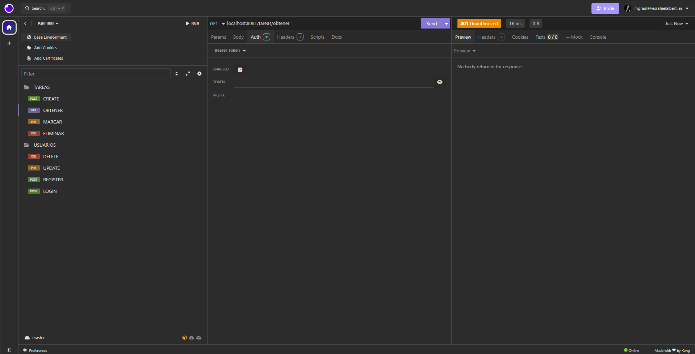

***

## ACTUALIZACIÓN DE TAREA EXITOSA

## DESCRIPCIÓN

Para esta prueba vamos a intentar actualizar el estado de una tarea en concreto con un usuario ADMIN y otro USER.

## CAPTURAS

### USUARIO ADMIN (TAREA PROPIA)

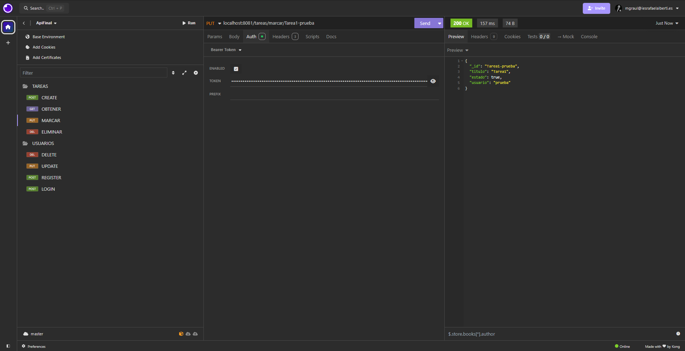

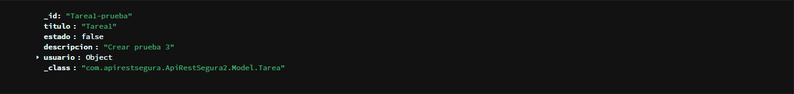

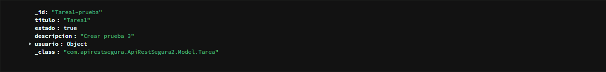

*** 

### USUARIO ADMIN (TAREA AJENA)

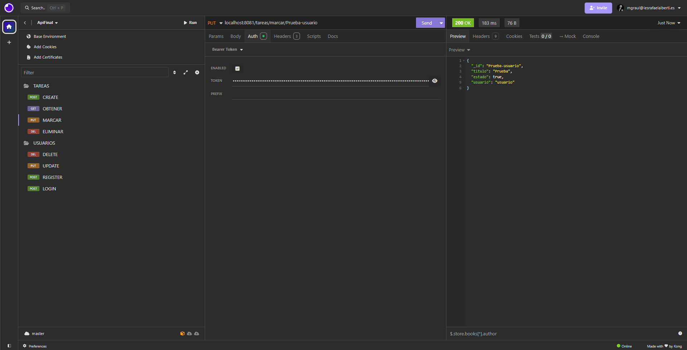

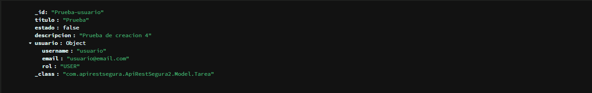

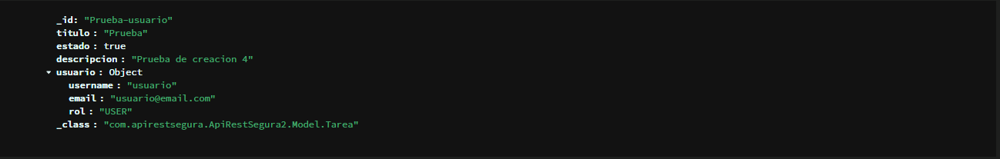

***

### USUARIO USER (TAREA PROPIA)

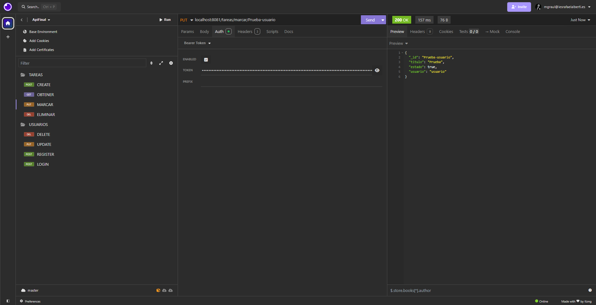

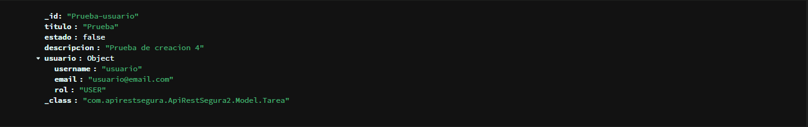

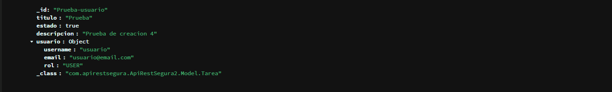

***

## ACTUALIZACIÓN DE TAREA FALLIDA

## DESCRIPCIÓN

Hay que tener en cuenta que este endpoint puede fallar por lo siguiente:
+ Siendo un usuario USER se intenta cambiar la tarea de otro usuario.
+ La tarea no existe.

### USUARIO USER (TAREA AJENA)

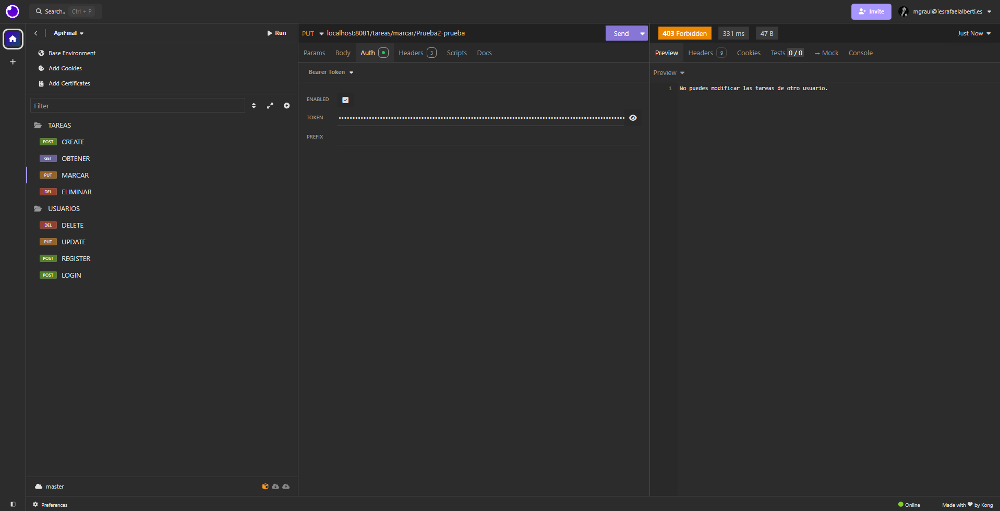

***

### LA TAREA NO EXISTE

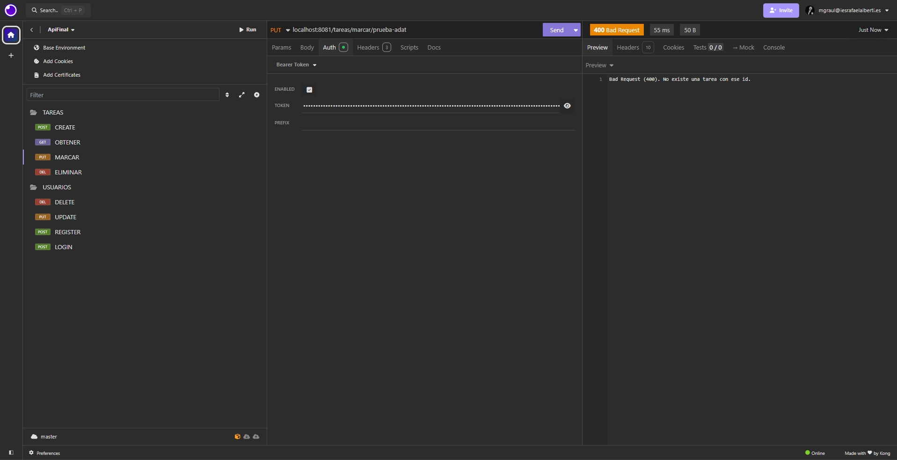